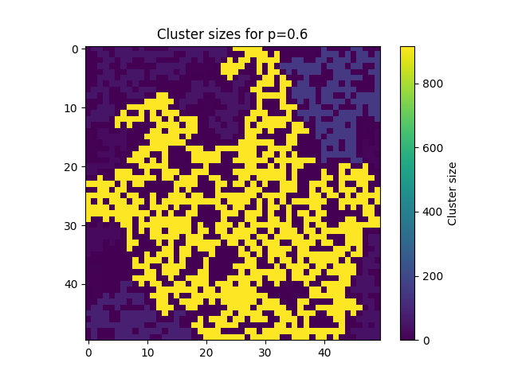
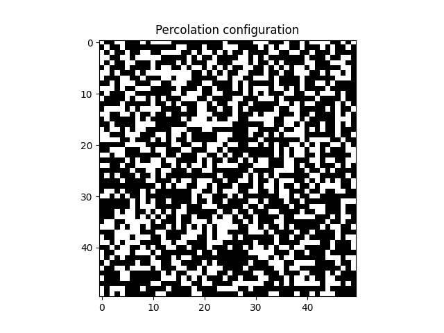
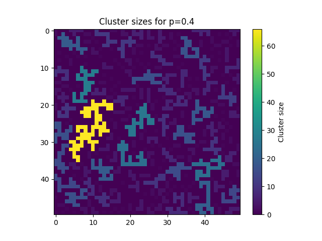
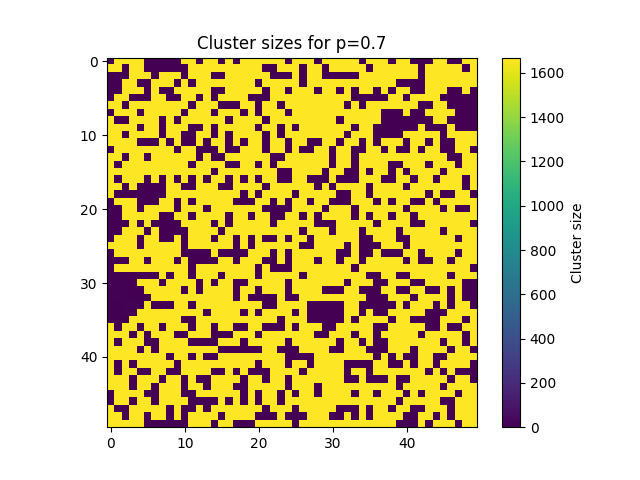
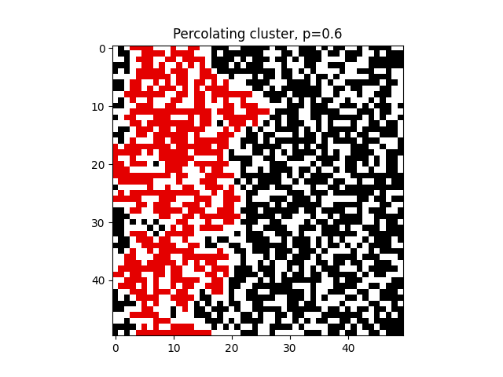
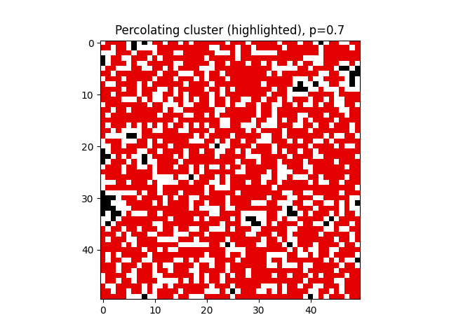

# Percolation Simulation

Simulation of site percolation on a 2D lattice implemented in Python.  
The project studies the emergence of a spanning cluster and estimates the percolation threshold using Monte Carlo simulations and BFS-based cluster detection.

## 1. Definition of Percolation

Percolation is a phenomenon in which a connected structure, called a cluster, emerges in a random medium.  
In the model used in this project, the medium is a two-dimensional n × n lattice where each site:

- is open with probability p,
- is closed with probability 1 − p.

Percolation is defined as a continuous path of open sites connecting the top and bottom boundaries of the lattice.

## 2. Applications of Percolation

Percolation models have applications in many fields, including:

- physics – flow of fluids through porous media,
- geology – penetration of water or oil through rocks,
- biology – spread of diseases,
- computer networks – robustness of networks to failures,
- sociology – spread of information in social networks,
- materials science – conductivity in composite materials.

Such simulations can illustrate, for example, whether an epidemic spreads through an entire region or whether a network remains connected after random failures.

## 3. Program Operation

The program:

1. Generates random lattice configurations for a given value of p.
2. Identifies clusters of open sites using the BFS algorithm.
3. Checks whether any cluster connects the top and bottom boundaries.
4. Repeats the simulation many times for the same value of p.
5. Computes the frequency of percolation and the average size of the largest cluster.
6. Repeats the entire procedure for different values of p.

Additionally, the program enables graphical analysis of cluster structures, including highlighting the percolating cluster.

## 4. Interpretation of the Plots (Simulation Results)

### Plot "Percolation vs p"

- X-axis: probability of a site being open p
- Y-axis: frequency of percolation occurrence

Based on the obtained results, it can be observed that:

- for small values p < 0.5, percolation almost never occurs, meaning that open sites form only small, isolated clusters,
- in the range p ≈ 0.55–0.65, a rapid increase in the frequency of percolation is observed, corresponding to a critical phenomenon; this behavior is consistent with the theoretical percolation threshold for an infinite square lattice, which is approximately p ≈ 0.59,
- for large values p > 0.65, percolation occurs almost always, because most sites are open and form one dominant cluster.

### Plot "Largest Cluster vs p"

- X-axis: probability p
- Y-axis: average size of the largest cluster

The analysis of the plot shows that:

- for small values of p, the largest clusters are small and grow slowly,
- near the percolation threshold, the size of the largest cluster increases rapidly,
- for larger values of p, one cluster occupies a significant portion of the lattice, indicating the dominance of a single connected region.

This behavior is characteristic of phase transitions and confirms the correctness of the simulation.

## 5. Interpretation of Lattice Visualizations

### Percolation Configuration (Black and White)

- white cells – open sites
- black cells – closed sites

The figure shows a single random lattice configuration for p = 0.6. From this visualization one can qualitatively assess the connectivity of the sites, although determining percolation requires cluster analysis performed by the program.

### Cluster Visualization

- each site is colored according to the size of the cluster it belongs to,
- the color scale represents the number of sites in the cluster.

From the visualizations for different values of p, it can be observed that:

- for p = 0.4, the system is below the percolation threshold, resulting in many small, isolated clusters and no dominant cluster connecting the top and bottom boundaries,
- for p = 0.6, a noticeably larger cluster appears, often corresponding to the percolating cluster,
- for p = 0.7, one cluster dominates and covers a large portion of the lattice.

Cluster visualization allows one to observe the transition from a dispersed structure to a system with a dominant cluster, which is characteristic of the percolation phenomenon.

### Highlighting the Percolating Cluster

When percolation occurs in the system, the percolating cluster is additionally highlighted in red against the background of the other sites. This makes it possible to clearly identify which cluster is responsible for percolation and facilitates visual analysis of the system's structure, especially near the critical threshold.

## How to run
pip install -r requirements.txt
python percolation.py

